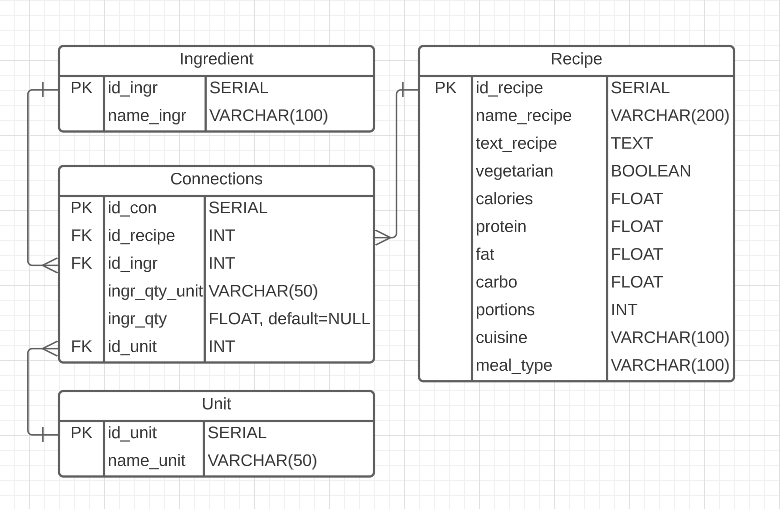

# Многопоточный автоматический парсинг сайта и занесение данных в базу PostgreSQL    
Результат проекта - база данных рецептов для дальнейшего использования при создании приложения.  
Реализован многопоточный автоматический парсинг сайта с рецептами и занесение структурированных данных в базу данных PostgreSQL. 

## СТРУКТУРА БАЗЫ ДАННЫХ

  
## Этапы проекта:  
- 1.1. Сбор ссылок сайта на страницы с рецептами.  
- 1.2. Парсинг по ссылкам п. 1.1  
- 1.3. Создание датафреймов в соответствии с приведенной выше структурой базы данных.  
- 2.1. Создание базы данных PostgreSQL и соответствующих таблиц в ней.  
- 2.2. Заполнение базы данными из датафреймов п. 1.3.  
  
### 1.1. Сбор ссылок сайта на страницы с рецептами.  
Многопоточный автоматический парсинг с использованием **Selenium**, **BeautifulSoup** и **concurrent** реализован в скрипте  *multigrab_urls.py* 

### 1.2. Парсинг по ссылкам.  
Многопоточный автоматический парсинг с использованием **Selenium**, **BeautifulSoup**, **bleach** и **concurrent**  реализован в скрипте  *scrap_recipes.py*. 

### 1.3. Создание датафреймов в соответствии с приведенной выше структурой базы данных.  
Реализовано в ноутбуке *make_dfs.ipynb*  

### 2.1. Создание базы данных PostgreSQL и соответствующих таблиц в ней.  
Реализовано в ноутбуке **create_db&tables.ipynb**  

### 2.2. Заполнение базы данными из датафреймов.  
Реализовано в ноутбуке *dfs_to_sql.ipynb*

